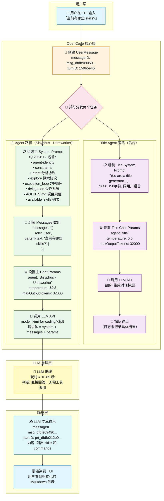
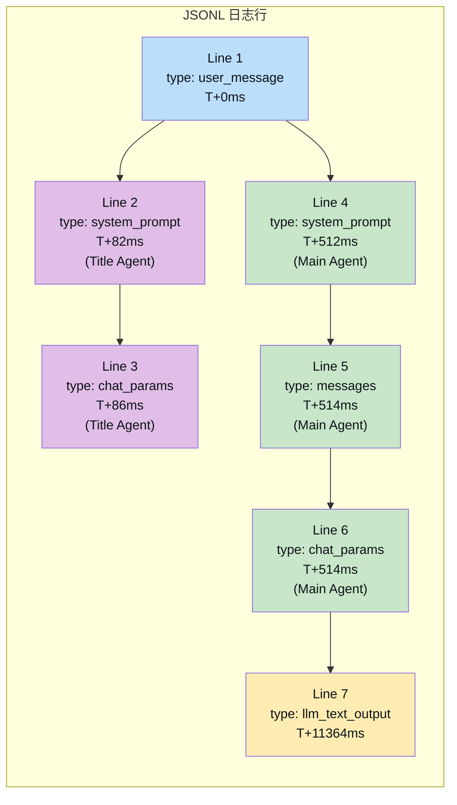
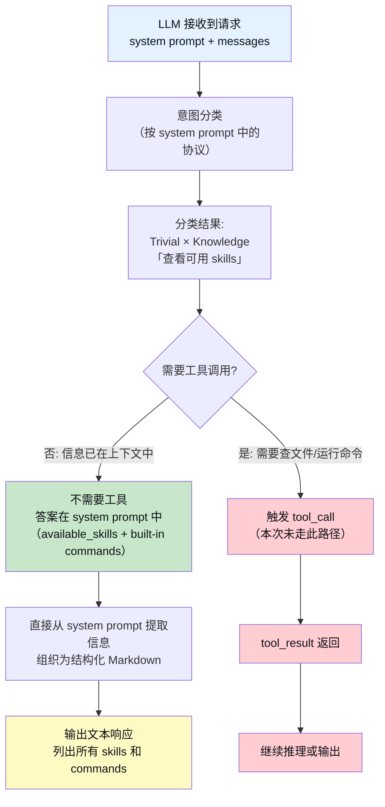
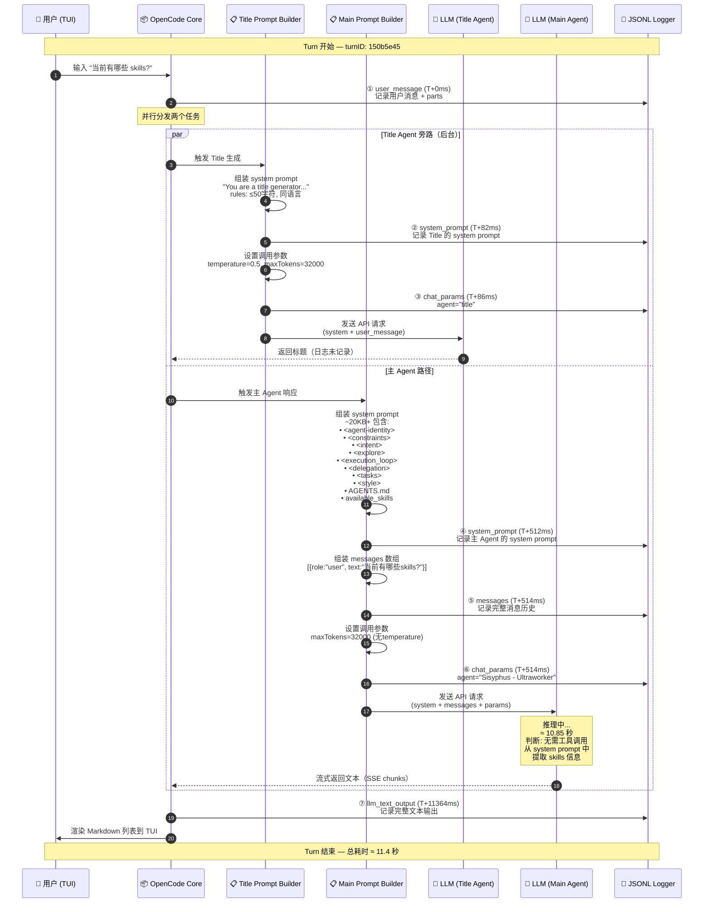
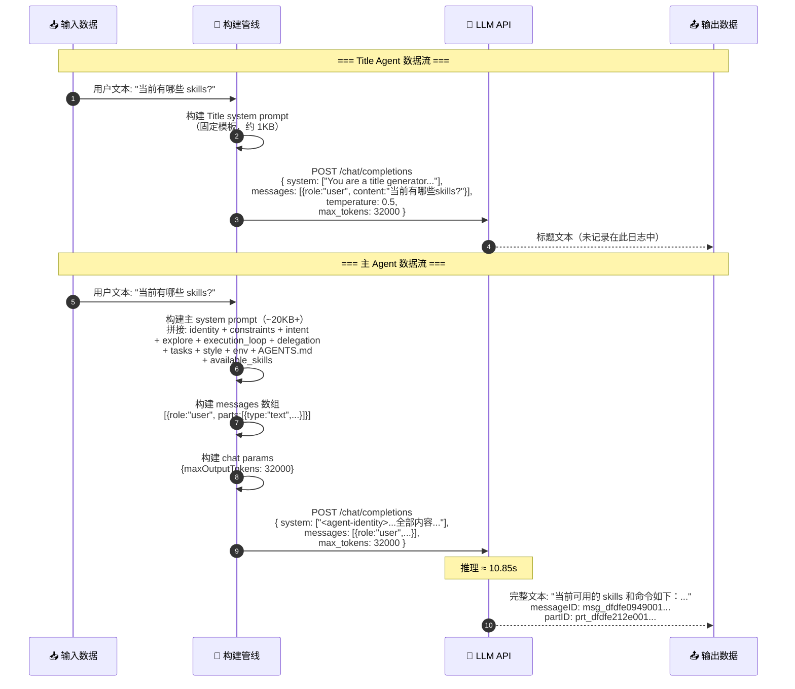
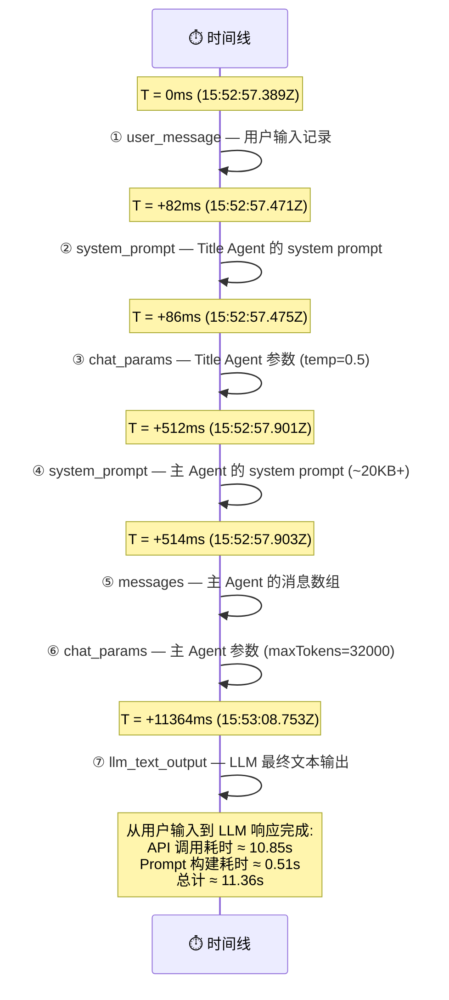

# OpenCode 单次会话完整 LLM 输入输出分析

> 数据来源：`logs/ses_20201f70fffe7a9sowrtvuze7t/150b5e45.jsonl`
> 会话场景：用户提问「当前有哪些 skills?」→ LLM 直接回答（无工具调用）
> 模型：`kimi-for-coding/k2p5`
> Agent：`Sisyphus - Ultraworker`
> 时间：2026-05-06T15:52:57 ~ 15:53:08（约 11 秒）

---

## 一、日志逐行详解

该 JSONL 文件共 7 行，每行是一个独立 JSON 对象，按时间戳排序。以下逐行解析：

### Line 1: `user_message` — 用户输入消息

```json
{
  "ts": "2026-05-06T15:52:57.389Z",
  "type": "user_message",
  "sessionID": "ses_20201f70fffe7a9sowrtvuze7t",
  "turnID": "150b5e45",
  "agent": "Sisyphus - Ultraworker",
  "messageID": "msg_dfdfe0905001MIKqOCyJ4vvsqc",
  "message": {
    "id": "msg_dfdfe0905001MIKqOCyJ4vvsqc",
    "role": "user",
    "sessionID": "ses_20201f70fffe7a9sowrtvuze7t",
    "time": { "created": 1778082777368 },
    "agent": "Sisyphus - Ultraworker",
    "model": { "providerID": "kimi-for-coding", "modelID": "k2p5" }
  },
  "parts": [
    {
      "id": "prt_dfdfe0905002a2a8NGhLOBbr9K",
      "type": "text",
      "text": "当前有哪些 skills?",
      "messageID": "msg_dfdfe0905001MIKqOCyJ4vvsqc",
      "sessionID": "ses_20201f70fffe7a9sowrtvuze7t"
    }
  ]
}
```

**解读：**
- 这是整个 turn 的**起点**——用户在 TUI 里输入了「当前有哪些 skills?」
- `turnID: "150b5e45"` 是本次 turn 的唯一标识，所有后续日志行共享该 turnID
- `message` 对象包含消息元数据（角色、时间、关联的 agent 和模型）
- `parts` 数组包含消息的实际内容片段，这里只有一个 `text` 类型的 part
- 注意：此时还没有任何 LLM 调用，这只是记录用户输入

### Line 2: `system_prompt`（第 1 次）— Title 生成器的 System Prompt

```json
{
  "ts": "2026-05-06T15:52:57.471Z",
  "type": "system_prompt",
  "sessionID": "ses_20201f70fffe7a9sowrtvuze7t",
  "turnID": "150b5e45",
  "model": { "providerID": "kimi-for-coding", "modelID": "k2p5" },
  "system": [
    "You are a title generator. You output ONLY a thread title. Nothing else.\r\n\r\n<task>\r\nGenerate a brief title...\r\n</task>\r\n\r\n<rules>\r\n- you MUST use the same language as the user message...\r\n- ≤50 characters...\r\n</rules>\r\n\r\n<examples>\r\n\"debug 500 errors in production\" → Debugging production 500 errors\r\n...\r\n</examples>"
  ]
}
```

**解读：**
- 在用户消息触发后的 **82ms**，系统首先为 **Title 生成** 组装 system prompt
- 这不是主对话的 system prompt，而是一个**旁路任务**——为这次对话自动生成标题
- `system` 是一个 `string[]`（数组），这里只有一个元素
- 该 prompt 规定：输出必须是单行、≤50字符、使用用户语言、不能使用工具
- 这说明 OpenCode 在每次新 turn 时**并行**触发了一个 title 生成请求

### Line 3: `chat_params`（第 1 次）— Title 生成器的调用参数

```json
{
  "ts": "2026-05-06T15:52:57.475Z",
  "type": "chat_params",
  "sessionID": "ses_20201f70fffe7a9sowrtvuze7t",
  "turnID": "150b5e45",
  "agent": "title",
  "model": { "providerID": "kimi-for-coding", "modelID": "k2p5" },
  "params": { "temperature": 0.5, "maxOutputTokens": 32000 }
}
```

**解读：**
- `agent: "title"` 明确标记这是 title agent 的参数
- 与主 agent `"Sisyphus - Ultraworker"` 不同
- `temperature: 0.5` 表示适度的创造性（主对话通常用更低值）
- `maxOutputTokens: 32000` 是一个宽松的上限（标题实际只需几个 token）
- 时间差仅 **4ms**（从 system_prompt 到 chat_params），说明这两步几乎同步

### Line 4: `system_prompt`（第 2 次）— 主 Agent 的 System Prompt

```json
{
  "ts": "2026-05-06T15:52:57.901Z",
  "type": "system_prompt",
  "sessionID": "ses_20201f70fffe7a9sowrtvuze7t",
  "turnID": "150b5e45",
  "model": { "providerID": "kimi-for-coding", "modelID": "k2p5" },
  "system": [
    "<agent-identity>\nYour designated identity for this session is \"Sisyphus\"...\n</agent-identity>\n<identity>\nYou are Sisyphus - an AI orchestrator from OhMyOpenCode...\n</identity>\n<constraints>...\n</constraints>\n<intent>...\n</intent>\n<explore>...\n</explore>\n<execution_loop>...\n</execution_loop>\n<delegation>...\n</delegation>\n<tasks>...\n</tasks>\n<style>...\n</style>\n<omo-env>\n  Timezone: UTC\n  Locale: en-US\n</omo-env>\nYou are powered by the model named k2p5...\n<env>\n  Working directory: .../packages/opencode\n  ...\n</env>\nInstructions from: .../AGENTS.md\n# opencode database guide\r\n...\nSkills provide specialized instructions...\n<available_skills>\n  <skill>\n    <name>effect</name>\n    ...\n  </skill>\n</available_skills>"
  ]
}
```

**解读：**
- 在 title 生成器的 system prompt 之后约 **430ms**，主 Agent 的 system prompt 被组装完成
- 这是一个**巨大的** system prompt（完整文本约 20KB+），包含：
  - `<agent-identity>` — Agent 身份声明（Sisyphus）
  - `<identity>` — 角色定义和核心能力
  - `<constraints>` — 硬性约束（不得使用 `as any`、不得自行 commit 等）
  - `<intent>` — 意图分析协议（复杂度分类 + 领域猜测）
  - `<explore>` — 探索与研究协议（agent 使用规则）
  - `<execution_loop>` — 7 步执行循环（探索→计划→路由→执行→验证→重试→完成）
  - `<delegation>` — 委托系统（类别 + 技能 + Oracle 使用规则）
  - `<tasks>` — Todo 管理规则
  - `<style>` — 输出风格约束
  - `<omo-env>` — 环境信息（时区、locale）
  - `AGENTS.md` 内容 — 项目和 opencode 包的代码规范
  - `<available_skills>` — 可用技能列表（这里只有 `effect`）
- `system` 数组仍是单元素，所有内容拼接在一个字符串中

### Line 5: `messages` — 发送给主 Agent 的消息数组

```json
{
  "ts": "2026-05-06T15:52:57.903Z",
  "type": "messages",
  "sessionID": "ses_20201f70fffe7a9sowrtvuze7t",
  "turnID": "150b5e45",
  "agent": "Sisyphus - Ultraworker",
  "messages": [
    {
      "role": "user",
      "id": "msg_dfdfe0905001MIKqOCyJ4vvsqc",
      "parts": [
        {
          "type": "text",
          "text": "当前有哪些 skills?",
          "id": "prt_dfdfe0905002a2a8NGhLOBbr9K",
          "sessionID": "ses_20201f70fffe7a9sowrtvuze7t",
          "messageID": "msg_dfdfe0905001MIKqOCyJ4vvsqc"
        }
      ]
    }
  ]
}
```

**解读：**
- 紧接 system prompt（相差仅 **2ms**），消息数组被记录
- `messages` 数组就是传递给 LLM API 的 `messages` 参数
- 因为这是**新对话的第一条消息**，数组中只有 1 个元素（用户消息）
- 如果是多轮对话，这里会包含完整的历史消息（user → assistant → user → ...）

### Line 6: `chat_params`（第 2 次）— 主 Agent 的调用参数

```json
{
  "ts": "2026-05-06T15:52:57.903Z",
  "type": "chat_params",
  "sessionID": "ses_20201f70fffe7a9sowrtvuze7t",
  "turnID": "150b5e45",
  "agent": "Sisyphus - Ultraworker",
  "model": { "providerID": "kimi-for-coding", "modelID": "k2p5" },
  "params": { "maxOutputTokens": 32000 }
}
```

**解读：**
- 与 Line 5 **同一毫秒**（15:52:57.903Z）
- 主 Agent 的参数比 title agent 更简洁——**没有设置 temperature**（意味着使用模型默认值）
- 只指定了 `maxOutputTokens: 32000`
- 此时 system prompt + messages + params 三件套齐全，LLM API 调用正式发起

### Line 7: `llm_text_output` — LLM 最终文本输出

```json
{
  "ts": "2026-05-06T15:53:08.753Z",
  "type": "llm_text_output",
  "sessionID": "ses_20201f70fffe7a9sowrtvuze7t",
  "turnID": "150b5e45",
  "messageID": "msg_dfdfe0949001RYvEJyATM7Vg83",
  "partID": "prt_dfdfe212e001Pt3WlFOHrE3P59",
  "text": "当前可用的 skills 和命令如下：\n\n## 项目级 Skills（1个）\n- **`effect`** — 处理 Effect v4 / effect-smol TypeScript 代码\n\n## Built-in Commands / Skills\n- **`/effect`** — 同 effect skill\n- **`/playwright`** — 浏览器自动化测试与截图\n- **`/frontend-ui-ux`** — 前端 UI/UX 设计开发\n- **`/git-master`** — Git 操作...\n- **`/review-work`** — 代码审查与 QA\n- **`/ai-slop-remover`** — 移除 AI 生成的代码异味\n...\n\n如需加载某个 skill 以获取详细指令，请告诉我..."
}
```

**解读：**
- LLM 响应完成，距 API 调用发起约 **10.85 秒**
- `messageID` 是一个**新的** ID（`msg_dfdfe0949001...`），不同于用户消息的 ID
- `partID` 标识输出中的特定 part（LLM 输出也是 part 模型）
- `text` 是完整的文本输出，格式化为 Markdown
- 注意：这里**没有**工具调用日志（因为 LLM 选择了直接回答而非调用工具）
- 注意：Title agent 的输出**没有被记录**在这个日志文件中（可能在别处或被省略）

---

## 二、日志字段完整对照表

| 字段 | 含义 | 出现位置 |
|------|------|----------|
| `ts` | ISO 8601 时间戳（UTC） | 所有行 |
| `type` | 日志类型标识 | 所有行 |
| `sessionID` | 会话唯一 ID（`ses_` 前缀） | 所有行 |
| `turnID` | 本轮对话唯一 ID（`150b5e45`） | 所有行 |
| `agent` | Agent 名称 | Line 1, 3, 4, 5, 6 |
| `messageID` | 消息唯一 ID（`msg_` 前缀） | Line 1, 7 |
| `message` | 消息元数据对象 | Line 1 |
| `message.role` | 消息角色（`user` / `assistant`） | Line 1 |
| `message.time.created` | Unix 毫秒时间戳 | Line 1 |
| `message.model` | 发送时关联的模型信息 | Line 1 |
| `parts` | 消息内容片段数组 | Line 1, 5 |
| `parts[].type` | Part 类型（`text` / `tool_call` / `tool_result`） | Line 1, 5 |
| `parts[].text` | 文本内容 | Line 1, 5 |
| `model` | 模型配置（providerID + modelID） | Line 2, 3, 4, 6 |
| `system` | System prompt 字符串数组 | Line 2, 4 |
| `params` | LLM 调用参数 | Line 3, 6 |
| `params.temperature` | 温度参数（创造性控制） | Line 3 |
| `params.maxOutputTokens` | 最大输出 token 数 | Line 3, 6 |
| `messages` | 发送给 LLM 的完整消息历史 | Line 5 |
| `text` | LLM 最终文本输出 | Line 7 |
| `partID` | 输出 Part 唯一 ID（`prt_` 前缀） | Line 7 |

---

## 三、完整流程图

### 3.1 整体流程（从用户输入到最终输出）



### 3.2 日志类型流程（聚焦日志记录时机）



### 3.3 决策流程（LLM 收到请求后的处理路径）



---

## 四、完整时序图

### 4.1 主时序图（包含所有参与方和时间线）



### 4.2 数据流向时序图（聚焦 "什么数据在什么时候被发送"）



### 4.3 日志记录时间线



---

## 五、关键发现与总结

### 5.1 单次 Turn 的日志类型清单

| 序号 | type | 描述 | 数量 | 对应 Hook |
|------|------|------|------|-----------|
| 1 | `user_message` | 用户输入消息 | 1 | `chat.message` |
| 2 | `system_prompt` | System prompt 组装完成 | 2（title + main） | `experimental.chat.system.transform` |
| 3 | `chat_params` | LLM 调用参数 | 2（title + main） | `chat.params` |
| 4 | `messages` | 发送给 LLM 的消息数组 | 1（仅 main） | `experimental.chat.messages.transform` |
| 5 | `llm_text_output` | LLM 文本输出 | 1（仅 main） | `experimental.text.complete` |

### 5.2 本次会话中**未出现**的日志类型

由于 LLM 选择了直接回答（无工具调用），以下日志类型缺席：

| 缺席的 type | 什么时候会出现 |
|-------------|---------------|
| `tool_call` | LLM 决定调用工具（如 read、bash、grep） |
| `tool_result` | 工具执行完成返回结果 |
| `llm_text_output`（多次） | 多轮工具调用时，每轮都有 LLM 输出 |
| `system_prompt`（更新） | 工具结果注入后重新组装 |

### 5.3 OpenCode 的两个并行 LLM 调用

```
用户输入
   ├── 【并行 1】Title Agent（后台）
   │     ├── system_prompt: 标题生成规则（~1KB）
   │     ├── chat_params: temperature=0.5
   │     └── 输出: 对话标题（日志未记录）
   │
   └── 【并行 2】Main Agent（前台）
         ├── system_prompt: 完整 agent 指令（~20KB+）
         ├── messages: [{role:"user", text:"当前有哪些skills?"}]
         ├── chat_params: maxOutputTokens=32000
         └── 输出: 完整回答文本 → 渲染给用户
```

### 5.4 时间开销分析

| 阶段 | 耗时 | 占比 |
|------|------|------|
| 用户消息记录 | 0ms（基准） | — |
| Title prompt 构建 | 82ms | 0.7% |
| 主 prompt 构建（含 AGENTS.md 读取） | 512ms | 4.5% |
| LLM 推理 + 流式传输 | 10,850ms | 95.5% |
| **总计** | **≈ 11,364ms** | **100%** |

### 5.5 日志文件命名规则

```
logs/
└── ses_20201f70fffe7a9sowrtvuze7t/   ← 会话 ID 作为目录名
    └── 150b5e45.jsonl                ← Turn ID 作为文件名
```

- 一个会话目录包含多个 `.jsonl` 文件，每个文件对应一次 turn
- 每个 turn 从用户输入开始，到 LLM 最终输出结束
- 如果 turn 中有工具调用，会包含更多行（tool_call、tool_result、多次 LLM 调用）

---

*基于 `logs/ses_20201f70fffe7a9sowrtvuze7t/150b5e45.jsonl` 分析 | 2026-05-06*
