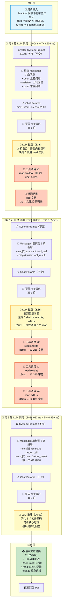
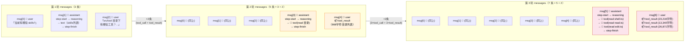
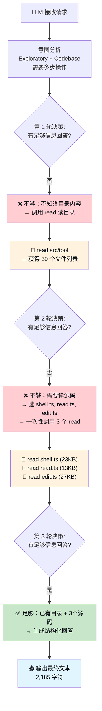
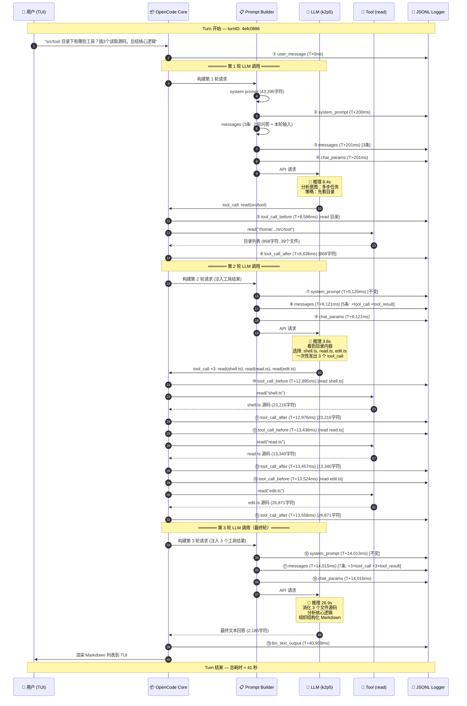
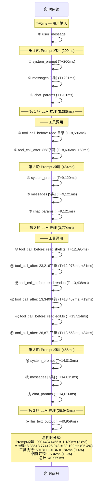
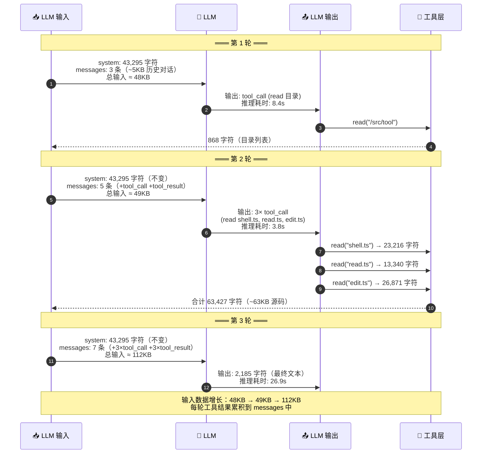

# OpenCode 多轮工具调用会话完整 LLM 输入输出分析

> 数据来源：`logs/ses_20201f70fffe7a9sowrtvuze7t/4efc0886.jsonl`
> 会话场景：用户提问「src/tool 目录下有哪些工具？挑 3 个读取它们的源码，总结每个工具的核心逻辑」
> 模型：`kimi-for-coding/k2p5`
> Agent：`Sisyphus - Ultraworker`
> 时间：2026-05-06T16:24:24 ~ 16:25:05（约 41 秒）
> **特点：包含 3 轮 LLM 调用、4 次工具调用（read ×4），是典型的多轮 agentic 会话**

---

## 一、会话总览：3 轮 LLM 调用 + 4 次工具调用

这个 turn 包含 **19 行日志**，体现了一个完整的 Agent Loop（agent 循环）：

```
用户输入
  → 第 1 轮 LLM 调用：分析任务，决定先 read 目录
    → 工具调用 #1：read src/tool（目录列表）
  → 第 2 轮 LLM 调用：看到目录内容，决定读 3 个文件
    → 工具调用 #2：read shell.ts（23KB）
    → 工具调用 #3：read read.ts（13KB）
    → 工具调用 #4：read edit.ts（27KB）
  → 第 3 轮 LLM 调用：综合所有文件内容，生成最终回答
```

### 日志行速查表

| 行号 | 时间偏移 | type | 内容摘要 | 所属阶段 |
|------|---------|------|---------|---------|
| 1 | T+0ms | `user_message` | 用户输入「src/tool 目录下有哪些工具…」 | 起点 |
| 2 | T+200ms | `system_prompt` | 主 Agent system prompt（43,295 字符） | 第 1 轮 LLM 输入 |
| 3 | T+201ms | `messages` | 消息历史（3 条：上轮问答 + 本轮用户输入） | 第 1 轮 LLM 输入 |
| 4 | T+201ms | `chat_params` | maxOutputTokens=32000 | 第 1 轮 LLM 输入 |
| 5 | T+8,586ms | `tool_call_before` | read src/tool（目录） | 第 1 轮 → 工具 |
| 6 | T+8,636ms | `tool_call_after` | 返回 868 字符（目录列表） | 工具结果 |
| 7 | T+9,120ms | `system_prompt` | 同上（43,295 字符，未变化） | 第 2 轮 LLM 输入 |
| 8 | T+9,121ms | `messages` | 消息历史（5 条：+assistant tool_call + user tool_result） | 第 2 轮 LLM 输入 |
| 9 | T+9,121ms | `chat_params` | maxOutputTokens=32000 | 第 2 轮 LLM 输入 |
| 10 | T+12,895ms | `tool_call_before` | read shell.ts | 第 2 轮 → 工具 |
| 11 | T+12,976ms | `tool_call_after` | 返回 23,216 字符 | 工具结果 |
| 12 | T+13,438ms | `tool_call_before` | read read.ts | 第 2 轮 → 工具 |
| 13 | T+13,457ms | `tool_call_after` | 返回 13,340 字符 | 工具结果 |
| 14 | T+13,524ms | `tool_call_before` | read edit.ts | 第 2 轮 → 工具 |
| 15 | T+13,558ms | `tool_call_after` | 返回 26,871 字符 | 工具结果 |
| 16 | T+14,013ms | `system_prompt` | 同上（43,295 字符，未变化） | 第 3 轮 LLM 输入 |
| 17 | T+14,015ms | `messages` | 消息历史（7 条：+assistant 3×tool_call + user 3×tool_result） | 第 3 轮 LLM 输入 |
| 18 | T+14,016ms | `chat_params` | maxOutputTokens=32000 | 第 3 轮 LLM 输入 |
| 19 | T+40,959ms | `llm_text_output` | 最终文本回答（2,185 字符） | 最终输出 |

---

## 二、日志逐行详解

### Line 1: `user_message` — 用户输入（Turn 起点）

```json
{
  "ts": "2026-05-06T16:24:24.960Z",
  "type": "user_message",
  "sessionID": "ses_20201f70fffe7a9sowrtvuze7t",
  "turnID": "4efc0886",
  "agent": "Sisyphus - Ultraworker",
  "messageID": "msg_dfe1ad662001Y4rOR171e13j1x",
  "message": {
    "id": "msg_dfe1ad662001Y4rOR171e13j1x",
    "role": "user",
    "sessionID": "ses_20201f70fffe7a9sowrtvuze7t",
    "time": { "created": 1778084664950 },
    "agent": "Sisyphus - Ultraworker",
    "model": { "providerID": "kimi-for-coding", "modelID": "k2p5" }
  },
  "parts": [
    {
      "id": "prt_dfe1ad662002DtiVYlN4eQLYH5",
      "type": "text",
      "text": "src/tool 目录下有哪些工具？挑 3 个读取它们的源码，总结每个工具的核心逻辑",
      "messageID": "msg_dfe1ad662001Y4rOR171e13j1x",
      "sessionID": "ses_20201f70fffe7a9sowrtvuze7t"
    }
  ]
}
```

**解读：**
- 这是本轮 turn 的**起点**，用户输入了一个**需要多步操作**的请求
- `turnID: "4efc0886"` 是本次 turn 的唯一 ID，后续 18 行日志共享这个 ID
- 这个请求隐含了 3 个子任务：①列出目录 ②选 3 个文件读源码 ③总结逻辑
- LLM 无法仅凭 system prompt 回答，**必须调用工具**
- 与上一个 turn（`150b5e45`，简单问答）不同，这里**没有 Title Agent 旁路**，因为这不是新会话的第一条消息

---

### Line 2: `system_prompt` — 第 1 轮 LLM 的 System Prompt

```json
{
  "ts": "2026-05-06T16:24:25.160Z",
  "type": "system_prompt",
  "sessionID": "ses_20201f70fffe7a9sowrtvuze7t",
  "turnID": "4efc0886",
  "model": { "providerID": "kimi-for-coding", "modelID": "k2p5" },
  "system": [
    "<agent-identity>\nYour designated identity for this session is \"Sisyphus\"...\n</agent-identity>\n<identity>...</identity>\n<constraints>...</constraints>\n<intent>...</intent>\n<explore>...</explore>\n<execution_loop>...</execution_loop>\n<delegation>...</delegation>\n<tasks>...</tasks>\n<style>...</style>\n<omo-env>...</omo-env>\n...AGENTS.md...\n<available_skills>...</available_skills>"
  ]
}
```

**解读：**
- 距用户输入 **200ms**，system prompt 组装完成
- 总长度 **43,295 字符**（约 43KB），与上一轮的 system prompt 完全相同
- **关键点**：system prompt 在整个 turn 的 3 轮 LLM 调用中**都不变**（Line 2 = Line 7 = Line 16，都是 43,295 字符）
- 这意味着：工具结果不会注入 system prompt，而是注入 messages 数组

---

### Line 3: `messages` — 第 1 轮 LLM 的消息历史（3 条消息）

```json
{
  "ts": "2026-05-06T16:24:25.161Z",
  "type": "messages",
  "sessionID": "ses_20201f70fffe7a9sowrtvuze7t",
  "turnID": "4efc0886",
  "agent": "Sisyphus - Ultraworker",
  "messages": [
    {
      "role": "user",
      "id": "msg_...",
      "parts": [
        { "type": "text", "text": "当前有哪些 skills?" }
      ]
    },
    {
      "role": "assistant",
      "id": "msg_...",
      "parts": [
        { "type": "step-start" },
        { "type": "reasoning" },
        { "type": "text", "text": "当前可用的 skills 和命令如下：..." },
        { "type": "step-finish" }
      ]
    },
    {
      "role": "user",
      "id": "msg_...",
      "parts": [
        { "type": "text", "text": "src/tool 目录下有哪些工具？挑 3 个读取它们的源码，总结每个工具的核心逻辑" }
      ]
    }
  ]
}
```

**解读：**
- 消息数组包含 **3 条消息**，来自同一 session 的历史：
  - `msg[0]` user：上一轮的用户提问「当前有哪些 skills?」
  - `msg[1]` assistant：上一轮的 LLM 回答（包含 step-start/reasoning/text/step-finish 四种 part）
  - `msg[2]` user：**本轮**的用户提问「src/tool 目录下有哪些工具？…」
- **关键发现**：assistant 消息的 parts 不仅仅是文本！它包含了 `step-start`、`reasoning`、`text`、`step-finish` 四种类型，这是 OpenCode 的 **Step 模型**——每轮 LLM 调用被包裹在一个 "step" 中
- 第 1 轮 LLM 拿到的上下文：**完整的对话历史**，它能看到之前回答过 skills 问题

---

### Line 4: `chat_params` — 第 1 轮 LLM 的调用参数

```json
{
  "ts": "2026-05-06T16:24:25.161Z",
  "type": "chat_params",
  "sessionID": "ses_20201f70fffe7a9sowrtvuze7t",
  "turnID": "4efc0886",
  "agent": "Sisyphus - Ultraworker",
  "model": { "providerID": "kimi-for-coding", "modelID": "k2p5" },
  "params": { "maxOutputTokens": 32000 }
}
```

**解读：**
- 与 Line 3 **同毫秒**（16:24:25.161Z），system + messages + params 三件套齐备
- 此时第 1 轮 LLM API 调用正式发出
- 参数简洁：只有 `maxOutputTokens: 32000`，无 temperature（使用默认值）

---

### Line 5: `tool_call_before` — 工具调用 #1：read 目录（调用前）

```json
{
  "ts": "2026-05-06T16:24:33.546Z",
  "type": "tool_call_before",
  "sessionID": "ses_20201f70fffe7a9sowrtvuze7t",
  "turnID": "4efc0886",
  "tool": "read",
  "callID": "tool_YqmyRX6G8a6SKSDWSTL04RiO",
  "args": {
    "filePath": "/home/lfl/agent-project/opencode/packages/opencode/src/tool"
  }
}
```

**解读：**
- 距 API 调用发出 **8,385ms**（约 8.4 秒），LLM 完成推理并决定调用 `read` 工具
- LLM 的策略：**先读目录**，看看有哪些文件，再决定读哪 3 个
- `callID: "tool_YqmyRX6G8a6SKSDWSTL04RiO"` 是工具调用的唯一标识，用于匹配 before/after
- `args.filePath` 指向 `src/tool` **目录**（不是文件）——read 工具支持读取目录列表
- 注意：这 8.4 秒就是 LLM **第 1 轮推理**的耗时，LLM 在思考意图分类、探索策略后才输出了 tool_call

---

### Line 6: `tool_call_after` — 工具调用 #1：read 目录（结果）

```json
{
  "ts": "2026-05-06T16:24:33.596Z",
  "type": "tool_call_after",
  "sessionID": "ses_20201f70fffe7a9sowrtvuze7t",
  "turnID": "4efc0886",
  "tool": "read",
  "callID": "tool_YqmyRX6G8a6SKSDWSTL04RiO",
  "args": {
    "filePath": "/home/lfl/agent-project/opencode/packages/opencode/src/tool"
  },
  "result": {
    "title": "opencode/packages/opencode/src/tool",
    "output": "<path>/home/.../src/tool</path>\n<type>directory</type>\n<entries>\napply_patch.ts\napply_patch.txt\nedit.ts\nedit.txt\nexternal-directory.ts\nglob.ts\nglob.txt\ngrep.ts\ngrep.txt\ninvalid.ts\nlsp.ts\nlsp.txt\nmcp-exa.ts\nplan-enter.txt\nplan-exit.txt\nplan.ts\nquestion.ts\nquestion.txt\nread.ts\nread.txt\nregistry.ts\nschema.ts\nshell\nshell.ts\nskill.ts\nskill.txt\ntask.ts\ntask.txt\ntodo.ts\ntodowrite.txt\ntool.ts\ntruncate.ts\ntruncation-dir.ts\nwebfetch.ts\nwebfetch.txt\nwebsearch.ts\nwebsearch.txt\nwrite.ts\nwrite.txt\n</entries>",
    "metadata": null
  }
}
```

**解读：**
- 工具执行耗时仅 **50ms**（本地文件系统操作，非常快）
- `callID` 与 Line 5 匹配，确认这是同一次调用的结果
- `args` 字段**重复出现**——after 事件同时记录了参数和结果，方便单独查看
- `result.output` 是 XML 格式的目录列表，包含 39 个文件/目录
- `result.title` 是 OpenCode 生成的人类可读标题
- 这 868 字符的目录列表将被注入到下一轮的 messages 中

---

### Line 7: `system_prompt` — 第 2 轮 LLM 的 System Prompt

```json
{
  "ts": "2026-05-06T16:24:34.080Z",
  "type": "system_prompt",
  "sessionID": "ses_20201f70fffe7a9sowrtvuze7t",
  "turnID": "4efc0886",
  "model": { "providerID": "kimi-for-coding", "modelID": "k2p5" },
  "system": ["<agent-identity>...(43,295 字符，与 Line 2 完全相同)..."]
}
```

**解读：**
- 工具结果返回后 **484ms**，第 2 轮 LLM 调用开始组装
- System prompt **未变化**（43,295 字符 = Line 2），工具结果不影响 system prompt
- 这个 484ms 是 OpenCode 将工具结果注入 messages 并重新组装请求的开销

---

### Line 8: `messages` — 第 2 轮 LLM 的消息历史（5 条消息，增长了 2 条）

```json
{
  "ts": "2026-05-06T16:24:34.081Z",
  "type": "messages",
  "sessionID": "ses_20201f70fffe7a9sowrtvuze7t",
  "turnID": "4efc0886",
  "agent": "Sisyphus - Ultraworker",
  "messages": [
    { "role": "user", "parts": [{ "type": "text", "text": "当前有哪些 skills?" }] },
    { "role": "assistant", "parts": [
        { "type": "step-start" },
        { "type": "reasoning" },
        { "type": "text", "text": "当前可用的 skills..." },
        { "type": "step-finish" }
    ] },
    { "role": "user", "parts": [{ "type": "text", "text": "src/tool 目录下有哪些工具？..." }] },
    { "role": "assistant", "parts": [
        { "type": "step-start" },
        { "type": "reasoning" },
        { "type": "tool" },
        { "type": "step-finish" }
    ] },
    { "role": "user", "parts": [
        { "type": "tool_result" }
    ] }
  ]
}
```

**解读：**
- 消息数组从 3 条**增长到 5 条**，新增了：
  - `msg[3]` assistant：第 1 轮 LLM 的输出（包含 `step-start` + `reasoning` + **`tool`** + `step-finish`）
    - 注意这里是 `"type": "tool"` 而不是 `"type": "text"`！LLM 选择了调用工具而非输出文本
  - `msg[4]` user：工具执行结果（`"type": "tool_result"`），角色是 "user" 因为工具结果被当作用户侧消息注入
- **消息历史增长模式**：每轮工具调用会增加 2 条消息（assistant 的 tool_call + user 的 tool_result）
- 这就是 **Agent Loop 的核心机制**：LLM → 工具调用 → 结果注入 messages → 再次调用 LLM

---

### Line 9: `chat_params` — 第 2 轮 LLM 的调用参数

```json
{
  "ts": "2026-05-06T16:24:34.081Z",
  "type": "chat_params",
  "sessionID": "ses_20201f70fffe7a9sowrtvuze7t",
  "turnID": "4efc0886",
  "agent": "Sisyphus - Ultraworker",
  "model": { "providerID": "kimi-for-coding", "modelID": "k2p5" },
  "params": { "maxOutputTokens": 32000 }
}
```

**解读：**
- 参数不变，第 2 轮 LLM API 调用发出
- 此时 LLM 已经能看到目录列表，将在这一轮决定读哪 3 个文件

---

### Line 10–11: 工具调用 #2：read shell.ts

```json
// Line 10: tool_call_before
{
  "ts": "2026-05-06T16:24:37.855Z",
  "type": "tool_call_before",
  "tool": "read",
  "callID": "tool_lGAjFHAmNwitRdKQCQgh6UZp",
  "args": { "filePath": ".../src/tool/shell.ts" }
}

// Line 11: tool_call_after
{
  "ts": "2026-05-06T16:24:37.936Z",
  "type": "tool_call_after",
  "tool": "read",
  "callID": "tool_lGAjFHAmNwitRdKQCQgh6UZp",
  "args": { "filePath": ".../src/tool/shell.ts" },
  "result": {
    "title": "opencode/packages/opencode/src/tool/shell.ts",
    "output": "<path>...</path>\n<type>file</type>\n<content>\n1: import { Effect, Stream } from \"effec...",
    "metadata": null
  }
}
```

**解读：**
- 第 2 轮 LLM 推理耗时 **3,774ms**（从 T+9,121ms 到 T+12,895ms），决定读 shell.ts
- 工具执行耗时 **81ms**，返回 **23,216 字符**（shell.ts 是个大文件）
- LLM 选择了 shell.ts 作为第一个要读的工具——这是一个合理的选择（shell 是核心工具）

---

### Line 12–13: 工具调用 #3：read read.ts

```json
// Line 12: tool_call_before
{
  "ts": "2026-05-06T16:24:38.398Z",
  "type": "tool_call_before",
  "tool": "read",
  "callID": "tool_8FdoTQOfLfTBzh7Gcpe27dp2",
  "args": { "filePath": ".../src/tool/read.ts" }
}

// Line 13: tool_call_after
{
  "ts": "2026-05-06T16:24:38.417Z",
  "type": "tool_call_after",
  "tool": "read",
  "callID": "tool_8FdoTQOfLfTBzh7Gcpe27dp2",
  "result": {
    "title": "opencode/packages/opencode/src/tool/read.ts",
    "output": "<path>...</path>\n<type>file</type>\n<content>\n1: import { Effect, Option, Schema, Scope...",
    "metadata": null
  }
}
```

**解读：**
- 距 shell.ts 调用仅 **462ms**（从 T+12,976ms 到 T+13,438ms），说明 LLM 在第 2 轮**一次性输出了 3 个 tool_call**
- 工具执行耗时仅 **19ms**，返回 **13,340 字符**
- 这 3 个 read 调用（Line 10–15）是**顺序执行**的（从时间戳看有间隔），但它们都来自第 2 轮 LLM 的同一次推理输出

---

### Line 14–15: 工具调用 #4：read edit.ts

```json
// Line 14: tool_call_before
{
  "ts": "2026-05-06T16:24:38.484Z",
  "type": "tool_call_before",
  "tool": "read",
  "callID": "tool_YGwrRGxLaPREZ48wvoMieCqZ",
  "args": { "filePath": ".../src/tool/edit.ts" }
}

// Line 15: tool_call_after
{
  "ts": "2026-05-06T16:24:38.518Z",
  "type": "tool_call_after",
  "tool": "read",
  "callID": "tool_YGwrRGxLaPREZ48wvoMieCqZ",
  "result": {
    "title": "opencode/packages/opencode/src/tool/edit.ts",
    "output": "<path>...</path>\n<type>file</type>\n<content>\n1: // the approaches in this edit tool ar...",
    "metadata": null
  }
}
```

**解读：**
- 距 read.ts 调用仅 **67ms**（from T+13,457ms to T+13,524ms）
- 工具执行耗时 **34ms**，返回 **26,871 字符**（edit.ts 是最大的文件）
- 至此，3 个文件的源码全部读取完毕，总共 **63,427 字符**的代码将被注入 messages

---

### Line 16: `system_prompt` — 第 3 轮 LLM 的 System Prompt

```json
{
  "ts": "2026-05-06T16:24:38.973Z",
  "type": "system_prompt",
  "sessionID": "ses_20201f70fffe7a9sowrtvuze7t",
  "turnID": "4efc0886",
  "model": { "providerID": "kimi-for-coding", "modelID": "k2p5" },
  "system": ["<agent-identity>...(43,295 字符，与 Line 2、Line 7 完全相同)..."]
}
```

**解读：**
- 距最后一个工具结果 **455ms**，第 3 轮 LLM 调用开始
- System prompt 依然不变（43,295 字符），**三轮都一样**

---

### Line 17: `messages` — 第 3 轮 LLM 的消息历史（7 条消息，增长了 2 条）

```json
{
  "ts": "2026-05-06T16:24:38.975Z",
  "type": "messages",
  "sessionID": "ses_20201f70fffe7a9sowrtvuze7t",
  "turnID": "4efc0886",
  "agent": "Sisyphus - Ultraworker",
  "messages": [
    { "role": "user", "parts": [{ "type": "text", "text": "当前有哪些 skills?" }] },
    { "role": "assistant", "parts": [
        { "type": "step-start" },
        { "type": "reasoning" },
        { "type": "text", "text": "当前可用的 skills..." },
        { "type": "step-finish" }
    ] },
    { "role": "user", "parts": [{ "type": "text", "text": "src/tool 目录下有哪些工具？..." }] },
    { "role": "assistant", "parts": [
        { "type": "step-start" },
        { "type": "reasoning" },
        { "type": "tool" },
        { "type": "step-finish" }
    ] },
    { "role": "user", "parts": [
        { "type": "tool_result" }
    ] },
    { "role": "assistant", "parts": [
        { "type": "step-start" },
        { "type": "reasoning" },
        { "type": "tool" },
        { "type": "tool" },
        { "type": "tool" },
        { "type": "step-finish" }
    ] },
    { "role": "user", "parts": [
        { "type": "tool_result" },
        { "type": "tool_result" },
        { "type": "tool_result" }
    ] }
  ]
}
```

**解读：**
- 消息数组从 5 条**增长到 7 条**，新增了：
  - `msg[5]` assistant：第 2 轮 LLM 的输出，包含 **3 个 tool** parts（一次性调用了 3 个工具）
  - `msg[6]` user：**3 个 tool_result** parts（3 个文件的内容，共 ~63KB）
- **关键对比**：
  - 第 1 轮 → 1 个 tool call → 1 个 tool result → messages 增加 2 条
  - 第 2 轮 → 3 个 tool calls → 3 个 tool results → messages 也只增加 2 条（多个工具调用打包在同一条 assistant 消息中）
- 此时 messages 中的总数据量非常大：system prompt 43KB + 历史对话 + 63KB 代码 ≈ **超过 100KB**

---

### Line 18: `chat_params` — 第 3 轮 LLM 的调用参数

```json
{
  "ts": "2026-05-06T16:24:38.976Z",
  "type": "chat_params",
  "sessionID": "ses_20201f70fffe7a9sowrtvuze7t",
  "turnID": "4efc0886",
  "agent": "Sisyphus - Ultraworker",
  "model": { "providerID": "kimi-for-coding", "modelID": "k2p5" },
  "params": { "maxOutputTokens": 32000 }
}
```

**解读：**
- 参数不变，第 3 轮 LLM API 调用发出
- 这是**最后一轮**，LLM 将基于所有收集到的信息生成最终回答

---

### Line 19: `llm_text_output` — 最终文本输出

```json
{
  "ts": "2026-05-06T16:25:05.919Z",
  "type": "llm_text_output",
  "sessionID": "ses_20201f70fffe7a9sowrtvuze7t",
  "turnID": "4efc0886",
  "messageID": "msg_dfe1b0c960012X06buW2Kq1cQt",
  "partID": "prt_dfe1b28b1001Aqnghyy2eY4h51",
  "text": "`src/tool` 目录下共有 **39 个文件**，包含以下工具：\n\n**文件类**：`read.ts`, `write.ts`, `edit.ts`, `apply_patch.ts`, `glob.ts`, `grep.ts`, `truncate.ts`, `truncation-dir.ts`\n**系统类**：`shell.ts`, `shell/`（子目录）\n**LSP/开发类**：`lsp.ts`, `mcp-exa.ts`\n**流程类**：`task.ts`, `todo.ts`, `plan.ts`, `question.ts`\n**其他**：`registry.ts`, `schema.ts`, `skill.ts`, `tool.ts`, `invalid.ts`, `external-directory.ts`, `webfetch.ts`, `websearch.ts`\n**以及对应的 `.txt` 描述文件**\n\n我选取了 3 个核心工具读取源码，总结如下：\n\n---\n\n### 1. `shell.ts` — Shell 命令执行工具\n\n**核心逻辑**：\n...\n\n### 2. `read.ts` — 文件/目录读取工具\n\n**核心逻辑**：\n...\n\n### 3. `edit.ts` — 文件编辑工具\n\n**核心逻辑**：\n..."
}
```

**解读：**
- 第 3 轮 LLM 推理耗时 **26,943ms**（约 27 秒，从 T+14,016ms 到 T+40,959ms）——这是最长的一轮，因为要消化 ~63KB 代码并生成结构化总结
- 最终输出 **2,185 字符**，是一个结构化的 Markdown 回答
- 输出内容分为两部分：①全部工具列表（分类整理）②3 个工具的核心逻辑总结
- `messageID` 和 `partID` 是新的 ID，标识这个输出

---

## 三、完整流程图

### 3.1 整体流程（3 轮 LLM 调用 + 4 次工具调用）



### 3.2 Messages 数组增长图（核心机制）



### 3.3 Agent Loop 决策流程



---

## 四、完整时序图

### 4.1 主时序图（所有参与方 + 3 轮 LLM 调用）



### 4.2 日志记录时间线（精确到毫秒）



### 4.3 数据量流向图



---

## 五、关键发现与总结

### 5.1 Agent Loop 的核心机制

一个 turn 内的多轮 LLM 调用遵循固定模式：

```
┌─────────────────────────────────────────────────────────────────┐
│                    Agent Loop 每轮结构                           │
│                                                                 │
│  ① system_prompt  ─── 固定不变，每轮都重发（43KB）               │
│  ② messages       ─── 累积增长，每轮追加 tool_call + tool_result │
│  ③ chat_params    ─── 固定不变（maxOutputTokens=32000）         │
│         │                                                       │
│         ▼                                                       │
│  ④ LLM API 调用 → 推理                                          │
│         │                                                       │
│         ├── 输出 text → 结束（最终轮）                           │
│         └── 输出 tool_call → 执行工具 → 注入结果 → 回到 ①       │
│                                                                 │
└─────────────────────────────────────────────────────────────────┘
```

### 5.2 Messages 数组增长规律

| 轮次 | 消息数 | 新增内容 | 累计数据量 |
|------|--------|---------|-----------|
| 第 1 轮 | 3 | 历史对话（上轮 Q&A） + 本轮用户输入 | ~5KB |
| 第 2 轮 | 5 | +1 assistant(tool) +1 user(tool_result) | ~6KB |
| 第 3 轮 | 7 | +1 assistant(3×tool) +1 user(3×tool_result) | ~69KB |

**关键发现**：多个工具调用**打包在同一条 assistant 消息**中，不是每个 tool_call 一条消息。同理，多个 tool_result 也打包在同一条 user 消息中。所以无论调用几个工具，每轮只增加 **2 条消息**。

### 5.3 Part 类型完整清单

本次会话中出现的所有 part 类型：

| Part 类型 | 出现位置 | 含义 |
|-----------|---------|------|
| `text` | user 消息, assistant 消息 | 纯文本内容 |
| `step-start` | assistant 消息 | Step 开始标记（每轮 LLM 调用的起点） |
| `reasoning` | assistant 消息 | LLM 的推理过程（think/reasoning） |
| `tool` | assistant 消息 | 工具调用（包含 toolName + args） |
| `step-finish` | assistant 消息 | Step 结束标记（每轮 LLM 调用的终点） |
| `tool_result` | user 消息 | 工具执行结果（由系统注入，角色为 user） |

### 5.4 时间开销分析

| 阶段 | 耗时 | 占比 | 说明 |
|------|------|------|------|
| Prompt 构建 ×3 | 1,139ms | 2.8% | 200 + 484 + 455ms |
| 第 1 轮 LLM 推理 | 8,385ms | 20.5% | 分析意图，决定读目录 |
| 第 2 轮 LLM 推理 | 3,774ms | 9.2% | 看目录，选 3 个文件 |
| 第 3 轮 LLM 推理 | 26,943ms | 65.8% | 消化 63KB 代码，生成总结 |
| 工具执行 ×4 | 184ms | 0.4% | 本地 FS 操作，极快 |
| 调度开销 | ~534ms | 1.3% | 工具结果 → prompt 构建间隙 |
| **总计** | **40,959ms** | **100%** | **≈ 41 秒** |

```
时间分布条形图：

LLM 推理  ████████████████████████████████████████████████ 95.4%
Prompt构建 █                                                2.8%
调度开销   ▌                                                1.3%
工具执行   ▏                                                0.4%
```

### 5.5 与无工具调用会话的对比

| 维度 | 简单问答 (150b5e45) | 多轮工具调用 (4efc0886) |
|------|---------------------|------------------------|
| 日志行数 | 7 行 | 19 行 |
| LLM 调用轮数 | 1 轮（+ title 旁路） | 3 轮 |
| 工具调用次数 | 0 | 4（read ×4） |
| Messages 增长 | 1 → 1（无变化） | 3 → 5 → 7 |
| 总耗时 | ~11.4s | ~41.0s |
| LLM 推理占比 | 95.5% | 95.4% |
| System prompt 变化 | 不变 | 不变（3 轮都相同） |
| Title Agent | 有（并行） | 无（非首条消息） |
| 最终输出长度 | ~1.5KB | ~2.2KB |

### 5.6 日志类型完整清单（含出现次数）

| type | 本次出现次数 | 每轮 LLM 的模式 |
|------|-------------|----------------|
| `user_message` | 1 | 仅 turn 开始时 1 次 |
| `system_prompt` | 3 | 每轮 LLM 调用 1 次 |
| `messages` | 3 | 每轮 LLM 调用 1 次 |
| `chat_params` | 3 | 每轮 LLM 调用 1 次 |
| `tool_call_before` | 4 | 每次工具调用 1 次 |
| `tool_call_after` | 4 | 每次工具调用 1 次 |
| `llm_text_output` | 1 | 仅最终轮输出文本时 1 次 |

**通用公式**：对于 N 轮 LLM 调用、M 次工具调用的 turn，日志行数 = 1 + 3N + 2M + 1 = 3N + 2M + 2

本次：N=3, M=4 → 3×3 + 2×4 + 2 = 19 行 ✓

---

*基于 `logs/ses_20201f70fffe7a9sowrtvuze7t/4efc0886.jsonl` 分析 | 2026-05-06*
